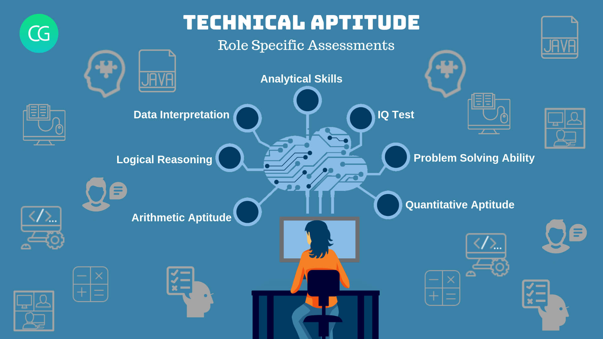

# Technical aptitude tests for interviews

## 🎯 Description

Aptitude technical skills that measure the developer's knowledge during the selection process for a job position in a company.

## 🧩 Content

List of aptitude tests by the companies:

- [Akkodis - BERSHKA](./companies/akkodis/README.md)
- [Walters People - ISID](./companies/walters-people/README.md)
- [Zataca Systems](./companies/zataca-systems/README.md)
- [Sunmedia TV](./companies/sunmedia-tv/README.md)
- [Woowbe](./companies/woowbe/README.md)
