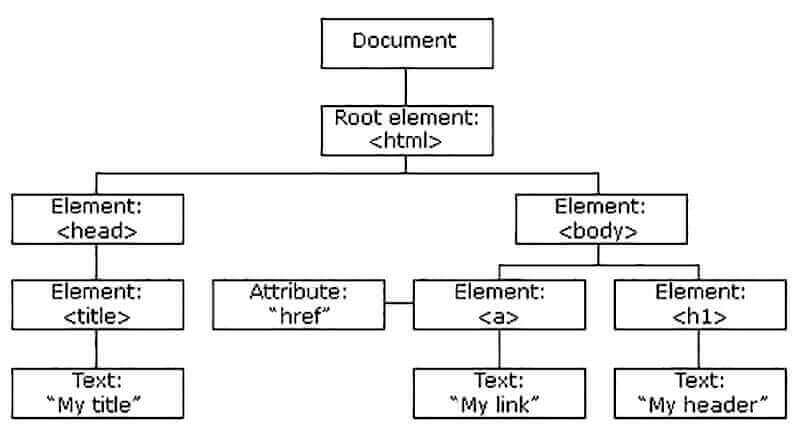
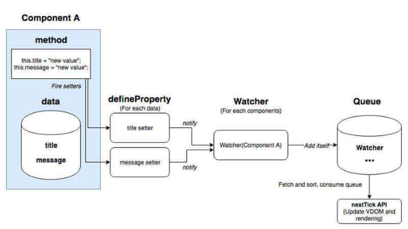

# ¿Qué es el DOM?

## Descripción

### BOM

El **DOM** se suele confundir con el **BOM**, que es la abreviatura de *Browser Object Model* o *Modelo de Objetos del Navegador*. La principal diferencia es que no tiene una implementación estándar o definición estricta, es decir, cada proveedor que desarrolló un navegador lo hizo según le convenía, aunque la mayoría de los navegadores modernos comparten los mismos objetos. Además, sus nodos no dependen unos de otros ni están anidados, todos ellos son hijos del nodo padre `Window`.

Algunos de los objetos comunes son:

- `Window`: Es el nivel superior y nos permite crear, mover, redimensionar, abrir y cerrar las ventanas del navegador.
- `Document`: Es el único que pertenece tanto al DOM como al BOM, nos permite trabajar con las propiedades del documento cargado, aunque precisamente por la falta de estándares en muchas implementaciones hay una confusión entre este y el objeto `Window`.
- `History`: Podemos manipular el historial de sesión del navegador como ver el número de páginas, moverse atrás o adelante en el histórico, o desplazarse a una página en concreto.
- `Location`: Permite guardar información sobre la ubicación o dirección URL de la página actual y redirigir el navegador a una nueva página.
- `Navigator`: Recoge una serie de propiedades, que nos proporcionan información sobre el propio navegador como su versión, las cookies o plugins.
- `Screen`: Nos proporciona datos sobre la pantalla del usuario como la resolución o el color.

### DOM

El **DOM** es la abreviatura que viene del término inglés *Document Object Model*, también conocida en español, como *Modelo de Objeto del Documento*. Es una interfaz de programación estándar, que nos permite acceder y actualizar dinámicamente el contenido, la estructura y el estilo de un documento `HTML`, `XHTML`, `XML` o `SVG`. Se representa con estructura jerárquica en forma de árbol, en el que cada nodo es un objeto, anidado uno dentro de otro, con sus propias propiedades y métodos.

Existen diferentes tipos de nodos:

- `Document`: Es el nodo raíz a partir del cual se crean los demás.
- `DocumentType`: Contiene los metadatos sobre el tipo de  documento.
- `Element`: Representa cada una de las etiquetas de apertura y cierre, que contienen atributos, los cuales son en sí otro tipo de nodo.
- `Attr`: Cada atributo de una etiqueta genera este nodo, el cual tiene su valor como una propiedad. Representa el par de datos: nombre y valor del atributo.
- `Text`: Almacena el contenido del texto, que se encuentra entre las etiquetas de apertura y cierre.
- `Comment`: Comentarios que se incluyen en el documento.

El DOM está desarrollado mediante un lenguaje de etiquetas, de cuyo nodo raíz `document` parte la etiqueta padre `<html></html>` y de esta sus 3 nodos hijos principales `<head></head>`, `<body></body>` y ``. A través de la etiqueta `script` y `head` podemos usar los lenguajes `Javascript` y `CSS`, para interactuar con la página, agregando eventos y estilos a esos elementos.

Antes de poder acceder, recorrer, crear, cambiar, o remover cualquier nodo del DOM es imprescindible que el documento web se haya cargado por completo, ya que cada nodo es dependiente uno del otro. En ese instante, `Javascript` crea el objeto `Node`, para definir las propiedades y métodos necesarios para procesar y manipular el documento.

### Virtual DOM

Dado que los tiempos de renderización de un sitio web influyen directamente en el posicionamiento de dicho sitio, hay que tener en cuenta que, cuantos más elementos tenga el DOM, más tardará en cargar la web, ya que, aumenta mucho el uso de memoria y hacen que los cálculos de los estilos de las hojas CSS duren más, por lo que reducir el uso de los mismos a los justamente necesarios para el maquetado de la web, influirá de manera positiva en su renderización.

Cuando nuestra aplicación crece se vuelve lenta, debido a que tiene cientos de nodos, que deben ser renderizados en el navegador. Para solucionar esto `VUE` y otros frameworks implementan un DOM virtual. El **DOM virtual** es una representación del DOM real en forma de objeto JS. Se utiliza con el objetivo de minimizar las interacciones con el DOM real.  
Permite controlar cuando se actualiza el DOM real, si un elemento se modifica repetidas veces podemos hacer que se renderize solo su última modificación. Es mucho menos costoso modificar una propiedad de un objeto JS, que un elemento de un árbol, por lo que una aplicación web con DOM virtual será mucho más eficiente. Además, solo se vuelven a renderizar los elementos que hayan sufrido algún cambio.

Cada vez que se instancia un componente de VUE se crea también un objeto `Watcher`, este objeto es el responsable de actualizar el DOM real y virtual, también se definen los `getters` y `setters` para cada elemento del componente con `defineProperty`. Cada vez que se llama a un `setter`, el `watcher` es notificado y agregado a una cola que no permite duplicados, de manera que no procese dos veces el mismo `watcher`. Entonces VUE automáticamente usa una función llamada `nextTick`, la cual llama a la función `run` de todos los `watchers` que se encuentren en la cola, esta es la función que copia los cambios hechos en el **DOM virtual** al **DOM real**.

## Referencias

- [Desarrolloweb: Qué es el DOM](https://desarrolloweb.com/articulos/que-es-el-dom.html)
- [Lenguajejs: ¿Qué es el DOM?](https://lenguajejs.com/javascript/dom/que-es/)
- [Freecodecamp: ¿Qué es el DOM? El significado del Modelo de Objeto de Documento en JavaScript](https://www.freecodecamp.org/espanol/news/que-es-el-dom-el-significado-del-modelo-de-objeto-de-documento-en-javascript/)
- [MDN: ¿Qué es el DOM?](https://developer.mozilla.org/es/docs/Web/API/Document_Object_Model/Introduction)
- [Codigofacilito: Qué es el DOM - Desarrollo Web Profesional](https://codigofacilito.com/articulos/javascript-dom-desarrollo-web)
- [Platzi: DOM](https://platzi.com/clases/2053-introweb/32973-dom/)
- [Keepcoding: ¿Qué es un nodo en el DOM?](https://keepcoding.io/blog/que-es-un-nodo-en-el-dom/#:~:text=El%20Document%20Object%20Model%2C%20al,para%20formar%20un%20%C3%A1rbol%20jer%C3%A1rquico.)
- [Manual de DOM](https://aprende-web.net/progra/dom/dom_1.php)
- [La diferencia entre BOM y DOM](https://programmerclick.com/article/91731577419/)
- [DOM o BOM](https://www.edgardandrea.com/dom-o-bom/#:~:text=Mientras%20DOM%20se%20centraliza%20en,ser%20totalmente%20independiente%20del%20navegador.)
- [Introducción al DOM y BOM](https://programacionfacil.org/cursos/javascript/capitulo-48-dom-bom.html)
- [DOM and BOM](https://prezi.com/wwmeeoufjz0o/dom-and-bom/)
- [El DOM y su relación con el SEO](https://www.conectasoftware.com/magazine/glosario/el-dom-y-su-relacion-con-el-seo/)
- [BOM (BROWSER OBJECT MODEL)](https://www.arkaitzgarro.com/javascript/capitulo-14.html)
- [DOM virtual en VUE](https://somospnt.com/blog/88-post-dom-virtual-2)
- [How Vue's reactivity works (I): Object.defineProperty](https://sergiocarracedo.es/how-vue-reactivity-works-i/)
