# ¿Qué es el Server Side Rendering (SSR)?

## Descripción

### ¿Qué es la renderización?

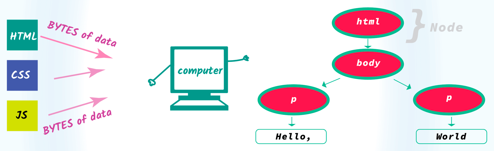

Antes que nada, debemos saber que el término [`renderización`](https://github.com/r-argentina-programa/traducciones/blob/master/src/renderizacion-navegadores.md) es el proceso que realiza un ordenador al interpretar el código de una página web, para mostrar en el navegador su representación gráfica.  
Gracias a la conversión del texto, de los documentos `HTML`, `CSS`, `JS` y otros recursos de una web, conseguimos ofrecer al usuario una estructura visual, con un estilo concreto y la posibilidad de interactuar con un contenido dinámico.

### ¿Qué significa _"Client Side"_ y _"Server Side"_?

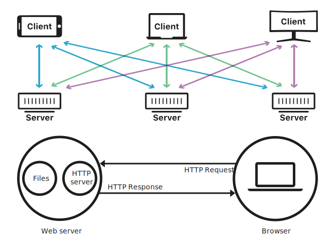

El _`"Client Side"`_ (_"Lado del Cliente"_) y el _`"Server Side"`_ (_"Lado del Servidor"_) son términos relacionados con el ámbito del software, que describen dónde se ejecuta el código durante el proceso de renderización.

Los desarrolladores también se refieren a esta distinción de _`"Client vs Server"`_ como _`"Frontend vs Backend"`_, aunque no son exactamente lo mismo.  
El _`"Frontend"`_ se refiere a la interfaz con la que el usuario interactúa para visualizar o buscar información.  
Mientras que el _`"Backend"`_ es la parte en la que servidor y base de datos trabajan juntos tras bastidores para entregar esa información al usuario.

Internet se basa en el modelo de arquitectura `cliente-servidor`, en el que los **dispositivos de los usuarios**, se comunican a través de la red con los **servidores centralizados**, para obtener los datos que necesitan.  
Estos equipos que realizan las solicitudes, como ordenadores, tablets y teléfonos, se denominan `clientes`, es decir, como si fueran los clientes que obtienen servicios de una empresa.  
Mientras que los `servidores` no son más que potentes ordenadores, dotados de hardware y software, al servicio de estos dispositivos a los que suministran información. Existen multitud de tipos, en este caso, un **servidor web**, es el encargado distribuir y entregar todos los archivos para mostrarlos a los usuarios a través del navegador, usando el protocolo de transferencia `HTTP`, sobre el cual se basa la red informática mundial `WWW`.

### ¿Qué pasa cuando escribes una URL en la barra del navegador?

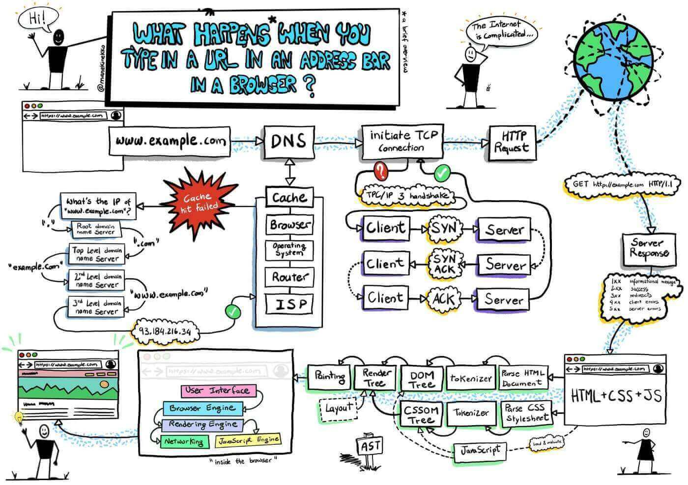

Cuando introduces una URL en la barra del navegador, se desencadena una serie de operaciones entre el **servidor** y el **cliente**.  
Es importante destacar que este proceso complejo ocurre en cuestión de milisegundos y se repite con cada nueva búsqueda. Su funcionamiento fluido y rápido es esencial para asegurar una experiencia de navegación satisfactoria en la web.

Este proceso puede resumirse en 4 pasos:
1. **Consulta la ubicación:** Los nombres de las páginas web conocidos como `dominios`, son direcciones amigables para los usuarios, pero en la red, son representados mediante unos códigos numéricos conocidos como `direcciones IP` públicas.  
El `servidor DNS` (_"Domain Name System"_), que posee una agenda completa de todas las direcciones de internet, realiza una consulta relacionando ambos, para identificar el servidor donde se encuentran los archivos.  
Por ejemplo, la dirección IP de la página web [http://www.google.com/](http://www.google.com/) es [http://142.251.211.238](http://142.251.211.238).  
Puedes obtenerla mediante herramientas online como [site24x7.com](https://www.site24x7.com/es/tools/buscar-direccion-ip.html) o a través de la terminal con el comando:
	```shell
	ping google.com
	```
2. **Comunicación con el servidor:** Una vez resuelta la consulta DNS con éxito, el navegador utiliza el protocolo `TCP/IP` (_"Transmission Control Protocol/Internet Protocol"_), para comunicarse con el **servidor remoto**, que tiene almacenada la web que pretendemos cargar. Este protocolo es un lenguaje que permite establecer una conexión e intercambiar datos entre 2 anfitriones para que se entiendan entre sí a través de la red.
3. **Preparación de la petición:** El servidor, tras comprender la petición, levanta la configuración específica de esa web, detectando los archivos que debe enviar y definiendo la prioridad de cada uno de ellos.
4. **Renderización en el navegador:** Finalmente, el **servidor web**, mediante el protocolo de transferencia `HTTP` (_"HyperText Transfer Protocol"_), descifra y transmite al navegador los datos recibidos, para facilitar la representación en pantalla la información que hemos solicitado.  
Por ejemplo, los archivos `PHP` deber ser interpretados previamente, para convertirlos en archivos `HTML`, ya que, el navegador no comprende los lenguajes del lado del servidor.

### Un poco de historia: Module, Package, Dependence, Library, Plugin, Framework y Meta-Framework

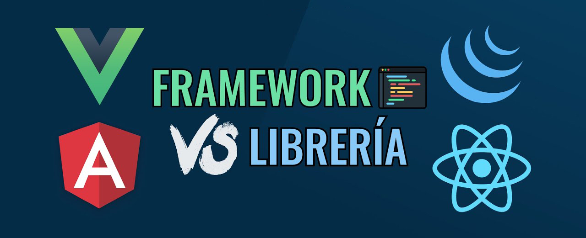

`JavaScript` (JS) es uno de los lenguajes más populares y de los más usados por los desarrolladores en los últimos años, ya que puede ser aplicado tanto en el **lado del cliente** como en el **lado del servidor**.  
Su rápida evolución ha generado cierta confusión entre varios términos clave, que resultan esenciales para decidir cuál de las tecnologías web modernas actuales, es la que más conveniente para tu próximo proyecto.

#### Código Espagueti y Principio DRY

Si observamos un proyecto web de hace algunos años, seguramente nos encontraremos una _"selva"_ de archivos desordenados y segmentos código repetidos, lo que hace que sea poco claro y difícilmente mantenible, esto es lo que se conoce como `código espagueti`.  
Por ello, todo programador cuando comienza, tarde o temprano acaba aprendiendo el principio conocido como `DRY`, acrónimo de _"Don't Repeat Yourself"_ (_"No te repitas a ti mismo"_), que consiste en empaquetar o agrupar el código y reutilizarlo. Por ejemplo, pueden existir diferentes situaciones en las que es necesario llevar a cabo una misma tarea, y en lugar de duplicar las mismas líneas de código en múltiples lugares, estas se encapsulan en una función, para invocarla tantas veces como necesites.

#### Module, Package y Dependencie

En el desarrollo de aplicaciones con `JS`, la modularidad es esencial para mantener un código ordenado y manejable. Esto nos introduce a los siguientes conceptos, que representan formas de organizar y compartir unidades de software:  
-   El _`"Module"`_ (_"Módulo"_) es un archivo que reúne funciones, clases y variables relacionadas entre sí formando **componentes**, que luego pueden ser exportados e importados en otras partes de nuestra aplicación. Permiten ocultar parte de su funcionalidad y solo exponer aquello para lo que ha sido implementado.  
-   Un _`"Package"`_ (_"Paquete"_) es un conjunto de módulos relacionados sobre una funcionalidad, agrupados para facilitar el intercambio de código entre otros desarrolladores.
-   La _`"Dependence"`_ (_"Dependencia"_) se refiere a aquel código externo a nuestra aplicación compuesto por paquetes creados por otros desarrolladores, que enlazamos o descargamos en nuestro proyecto.

Podemos dividir nuestro propio código `JS` en componentes, creando `módulos` en diferentes archivos, que se comunican entre sí, exportando e importando las funciones donde se necesiten. Esto te permite enfocarte en una funcionalidad específica en cada módulo y luego unirlos para construir la aplicación completa.  
Además de crear tus propios módulos, también puedes aprovechar el trabajo de otros desarrolladores, que han creado y exportado sus propias _`"Libraries"`_ y _`"Frameworks"`_ como `módulos` para ofrecer soluciones a problemas comunes.  
En el pasado, estas `dependencias` solían enlazarse directamente al archivo `HTML`. Sin embargo, esta práctica puede volverse complicada a medida que la aplicación crece y se introducen actualizaciones. Para abordar este problema, ahora es más habitual descargarlas como `paquetes`, usando los administradores de paquetes, como `NPM` (_"Node Package Manager"_), y `Node` a través de comandos en la terminal. Esto garantiza la gestión de versiones y la actualización del código del proyecto de manera eficiente, ya que hacerlo manualmente puede generar conflictos entre las `dependencias`.

#### Library

De esta forma surge el concepto _`"Library"`_, un conjunto de fragmentos de código que brindan funcionalidades para resolver problemas o necesidades específicas, y que pueden ser reutilizadas en diferentes tipos de proyectos, optimizando así el código desarrollado. Es decir, una serie de herramientas que puedes incluir en un proyecto, sin depender de una estructura en particular y eres libre de usarlas tantas veces como necesites.  
Por ejemplo, existen _"Librerías"_ para crear lo mismo escribiendo menos código (`Jquery`), generar gráficos (`ChartJS`), hacer galerías (`SwiperJS`), manipular fechas (`MomentJS`), convertir informes en archivos PDF (`jasperReports`), realizar cálculos matemáticos (`MathJS`) o controlar animaciones (`animeJS`).

Hay que decir, que existe un cierto debate entre _`"Librería"`_ o _`"Biblioteca"`_. El concepto es conocido comúnmente como _"Library"_ en inglés, cuya traducción al castellano es _"Biblioteca"_, y aunque no sea su traducción literal, ambos son aceptados para hablar de lo mismo en la comunidad informática.

#### Plugin vs Library

Sabiendo esto, podemos aclarar también qué término _`"Plugin"`_ es un complemento o extensión para personalizar un programa, que mejora las capacidades de una aplicación o le agrega una nueva funcionalidad a las ya existentes, mientras que una _`"Library"`_ es una colección de clases y funciones que ayudan a desarrollar un software.  
Por ejemplo, existen _"Plugins"_ para `Photoshop`, que agregan filtros adicionales para procesar las imágenes, o para el navegador como `Lighthouse`, que genera informes sobre el rendimiento y la calidad para la corrección de errores de un sitio web.

#### Framework

Tras esto, la aparición de los famosos _`"Frameworks"`_ que conocemos hoy, dieron un paso más. En el _"Frontend"_, han supuesto la posibilidad de arreglar problemas, que en el _"Backend"_ se consiguieron solucionar hace tiempo, que es sobre todo la ordenación y limpieza del código.

Así, raíz de esta necesidad, surgió el término _`"Framework"`_, un entorno o modelo de trabajo que ofrece una estructura estandarizada, que incluye un conjunto de _"Librerías"_ y sigue un patrón de diseño, es decir, un conjunto de prácticas, conceptos y criterios. Con el objetivo de facilitar y reducir el tiempo de desarrollo de aplicaciones o sitios web complejos, es decir, para elaborar un proyecto de forma más rápida y organizada.  
Por lo que trajeron muchas ventajas, favoreciendo el trabajo colaborativo, agilizando los procesos de desarrollo al reutilizar herramientas o módulos externos, evitando tener que escribir código de forma repetitiva, lo que reduce la posibilidad de errores y nos obliga a utilizar buenas prácticas. En conclusión, te obligan a ser un poco más ordenado, basando su estructura en **componentes**, en los cuales cada uno encapsula su código `HTML`, `CSS`, `JS` en una misma carpeta o archivo.

#### Library vs Framework

En este contexto, se debate ampliamente sobre si `React` es una _"Librería"_ o un _"Framework"_ de `JS`, ya que ambos conceptos están muy relacionados y existe una línea difusa entre ellos.

Por sorprendente que parezca, para gran parte de los desarrolladores, `React` no es comúnmente reconocido como un _"Framework"_. Oficialmente en su página web, se autodenomina como _"Library for web and native user interfaces"_, esto es debido a que su **enfoque minimalista y modular, requiere complementos adicionales** para crear una aplicación completa. Por ejemplo, `React` no ofrece un sistema de enrutado integrado, hay que añadir una _"Librería"_ como `React Router` y para la gestión del estado otra llamada `Redux`.  
Siguiendo este razonamiento, `Vue` podría considerarse también una _"Librería"_, ya que para funciones similares hay que instalar `Vue Router` y `Vuex`. A pesar de ello, oficialmente en su página web lo definen como un _"Progressive JavaScript Framework"_, para resaltar su enfoque flexible y escalable.  
En cuanto a `Angular`, su caso es diferente, ofrece una solución completa para el desarrollo de aplicaciones web, proporcionando todas sus funcionalidades de manera nativa.

Esto no nos saca del todo de dudas, así que algo imprescindible para considerar si se trata de un _"Framework"_ o no, es saber si dispone de la existencia de un sistema de organización con una estructura sólida, definida y estandarizada que siga unos criterios.  
En este aspecto, `React` es más **flexible, no imponen una estructura específica predeterminada**, por lo que depende en gran medida de las preferencias del desarrollador o las necesidades del proyecto.  
En cambio, `Vue` ofrece recomendaciones más concretas como separar componentes en carpetas específicas y seguir un enfoque modular. Aunque no puede compararse con el estricto y complejo _"Framework"_ `Angular`, cuya estructura es rigurosamente impuesta.

En conclusión, la distinción entre _"Librerías"_ y _"Frameworks"_ es susceptible de variación según la perspectiva. Si bien `Vue` y `React` pueden no ser _"Frameworks"_ completos en todos los aspectos, ciertamente proporcionan una base sólida para crear componentes interactivos y dinámicos con herramientas poderosas que van más allá que una simple _"Librería"_. Es decir, puedes desarrollar una interfaz funcional completa sin instalar _"Librerías"_ adicionales.

#### Meta-Framework

El problema de estos populares _"Frameworks"_ y _"Librerías"_ del _"Frontend"_ como `Vue`, `React`, `Angular` o `Svelte`, es que renderizan todo el contenido en el **lado del cliente**, y esto no es válido para todos los proyectos.  
Esta limitación dio origen a los llamados _`"Meta-Frameworks"`_, que renderizan el contenido en el **lado del servidor**, los más populares son `Nuxt` (basado de `Vue`) y `NextJs` (basado de `React`).  
El problema que vienen a resolver, es básicamente para cubrir dos áreas oscuras del desarrollo moderno: el **SEO** (_"Search Engine Optimization"_), es decir, que los buscadores de Google te encuentren e indexen tu contenido; y **aumentar la velocidad de carga inicial**, es decir, que la primera vez que accedas a tu sitio lo haga más rápido.

A partir de todo esto se debate sobre que renderizado es mejor, si el del lado del cliente o el del servidor.

### Métodos de Renderizado en los Frameworks y Librerías

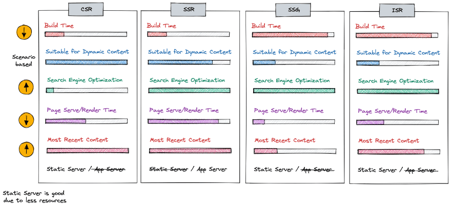

El renderizado de páginas web es un aspecto crucial del desarrollo web, y entender los diferentes enfoques puede ayudarte a decidir cuál es el que más te conviene para construir y mantener tu aplicación.  
Todo _"Framework"_ fue creado para desarrollar interfaces de sitios web, así que desde este punto de vista, todos parecen iguales, pero la forma de distinguirlos no está en lo que producen, sino en como lo producen. De este modo, podemos categorizarlos por sus `Métodos de Renderizado`, es decir, por la forma en que se procesan los archivos antes de crear las páginas.

#### ¿Qué es el _"Pre-rendering"_?

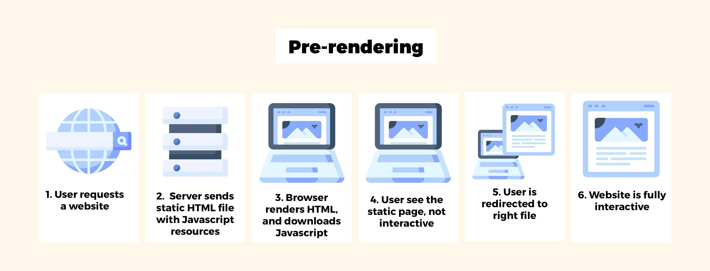

Podemos clasificar las aplicaciones o sitios web en función del lugar y el momento en el que ocurre el proceso del renderizado, es decir, si transcurren en el lado del cliente, en el lado del servidor o en ambos.

La técnica _`"Pre-rendering"`_ (_"Renderizado previo"_), fue una de las primeras utilizadas en el mundo del software. Como su nombre sugiere, renderiza o procesa previamente cada página de forma predeterminada en el **lado del servidor** antes de enviarla al navegador. En lugar de compilar los archivos sobre la marcha en el lado del cliente, genera por adelantado todos archivos estáticos para cada ruta específica.  
La ventaja de usar este método, es que la configuración inicial es mucho más sencilla y nos permite mantener nuestro _"Frontend"_ como un sitio totalmente estático. De esta manera, nuestra página web está completamente disponible para el navegador, así como para los rastreadores de los motores de búsqueda, lo que nos brinda una mejor puntuación y rendimiento de **SEO**.  
Hace uso del conocido **_`"Server Side Rendering (SSR)"`_** para generar sitios web del tipo **_`"Multi-Page Applications (MPA)"`_**, también conocidos como **_"Template Rendering"_** y ha evolucionado en otros métodos más avanzados como **_"Static Site Generation (SSG)"_**, **_"Incremental Static Regeneration (ISR)"_**, **_"Distributed Persistent Rendering (DPR)"_** y **_"Edge Rendering"_**.

En los últimos años, ha surgido el renderizado en el **lado del cliente**, para mejorar la velocidad durante la interacción del usuario, dando lugar a sitios web del tipo **_`"Single-Page Applications (SPA)"`_** que utilizan el método de renderizado **_`"Client Side Rendering (CSR)"`_**.

Y finalmente, se ha buscado un equilibrio entre una carga inicial rápida en el lado del servidor y una interacción fluida en el lado del cliente. Pudiendo aprovechar la opción de combinar **ambos enfoques**, lo que da lugar a sitios web denominados **_`"Isomorphic/Universal Applications"`_**, que hacen uso tanto del **_`"Server Side Rendering (SSR)"`_** como del **_`"Client Side Rendering (CSR)"`_**.

#### Server Side Rendering (SSR)

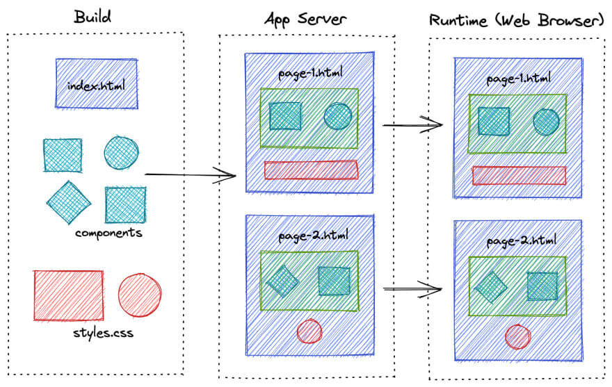
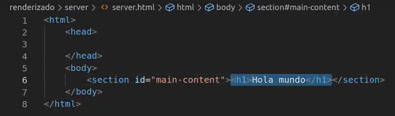

El _`"Server Side Rendering (SSR)"`_, es un proceso mediante el cual una aplicación web se renderiza en el **lado del servidor** antes de ser enviada al navegador del cliente.  
No se debe confundir con el concepto de _"Static Site Generation (SSG)"_, que genera los archivos estáticos durante el desarrollo de la aplicación antes de desplegarlos a producción y utiliza el servidor para enviarlos al navegador del cliente.  
Se trata de una técnica opuesta a las _"Single Page Applications (SPA)"_, ya que permite que la aplicación esté totalmente renderizada e interactiva cuando el cliente la carga, en lugar de tener que esperar a que se descargue y se renderice en el navegador.

Lo que significa que toda la responsabilidad reside sobre el servidor, que crea físicamente cada página de la web, en cada solicitud como si fuera por primera vez. Es decir, genera múltiples páginas con su contenido, estilos y funcionalidad, repetidamente a medida que el usuario solicita una nueva URL, y es por esto que se conocen como _`"Multi-Page Applications (MPA)"`_.

Para construir los archivos `HTML` de la interfaz, estos _"Frameworks"_ usan _"Librerías"_ de motores de plantillas o _`"Template Engines"`_, de hecho es por esto que también se conocen como _`"Template Rendering"`_. Estos motores permiten que en el código `HTML` se pueda usar lógica de programación como **condicionales**, **bucles** y **funciones** dentro de interpolaciones, pero al final el _"Framework"_ los convertirá en `HTML` antes de enviarlos al cliente.  
Algunos _"Frameworks"_, que entran en esta categoría, pueden utilizar múltiples motores de plantillas, por ejemplo:
- En el lenguaje `PHP`, destacan los _"Frameworks"_ `Laravel` que puede usar el motor de plantillas `Balde`, y `Symfony` que puede emplear `Twig`.
- En el lenguaje `JS`, muchos _"Frameworks"_ utilizan el entorno `NodeJS` para poder ejecutar el código en el lado del servidor. Podemos destacar el _"Framework"_ `ExpressJS`, y las _"Librerías"_ `MustacheJS`, `Handlebars`, `EJS` y `PugJS` como motores de plantillas.
Es importante mencionar que los _"Meta-Frameworks"_ `Nuxt`, `NextJS` y `Angular Universal`, que se construyen sobre las bases de `Vue`, `React` y `Angular`, respectivamente, integran sus propios motores de plantillas, llevando la funcionalidad a un nivel más avanzado.

Funciona de la siguiente manera:
1. **Solicitud:** El cliente realiza la solicitud de la página web que desea ver.
2. **Interpretación:** Una vez que el servidor recibe la solicitud, se inicia el proceso de renderización de la página solicitada. Durante el renderizado, el `HTML` que devuelve como respuesta de la petición al cliente, está completo, con todo el contenido y otros recursos necesarios. De esta forma, el navegador lo único que tiene que hacer es interpretarlo, no tiene que ejecutar ningún _"Framework"_ que se dedique a construir el contenido en la página, sino que ese código ya es suficiente para construir la página visible, funcional e interactiva. Es decir, el código del _"Framework"_, se compila en el servidor, no en el navegador y como resultado, se crea un `HTML` simple y significativo inmediatamente.

En el pasado, era común utilizar diferentes lenguajes para ambos lados, como `PHP` para _"Backend"_ y `JS` para _"Frontend"_. Esto requería aprender y trabajar con dos lenguajes y _"Frameworks"_ para cada lado, lo que hacía el desarrollo más complejo.  
Hoy en dia, con la llegada de `NodeJS`, podemos aprovechar la ventaja de usar el mismo lenguaje `JS` tanto en el _"Frontend"_ (el lado del cliente) como en el _"Backend"_ (el lado del servidor), para simplificar la comunicación entre ambos lados. Lo que hace que el desarrollo sea más coherente y eficiente, ya que puedes compartir el código de las mismas _"Librerías"_ para las mismas tareas, como manejar solicitudes, procesar datos y renderizar contenido tanto en el navegador como en el servidor.  
Todos estos Frameworks de `JS` utilizan `NodeJS` como entorno de desarrollo, así que es más fácil implementarlo como servidor generalmente unido a un framework de `NodeJS` llamado `Express`, al usar prácticamente el mismo lenguaje, es decir, puedes utilizar `Javascript` en el front y en el back para poder comunicarlos utilizando las mismas bibliotecas.

Este enfoque tiene ventajas en cuanto a:
1. **SEO:** Cuando el `HTML` llega generado al navegador, este puede leer el contenido y saber de qué se trata, al poder extraer párrafos, enlaces y todo tipo de etiquetas, haciendo que rápidamente sea indexable por robots de los motores de búsqueda.
2. **Seguridad:** Son más seguros, al estar toda la lógica en el _"Backend"_ y el usuario final solo ve el resultado en el _"Frontend"_.
3. **Adaptabilidad:** Tiene facilidad de integrarse con base de datos y herramientas que requieran del Sistema Operativo, al ya estar en un servidor.
4. **Despliegue:** Son fáciles de desplegar al ya estar toda la aplicación en un mismo proyecto.
5. **Velocidad:** La generación de `HTML` en el servidor, hace que el navegador soporte menos esfuerzo, lo que permite que las páginas se carguen más rápido en la carga inicial. No necesita esperar hasta que se haya descargado y ejecutado todo el `JS` para que se muestre, de modo que el usuario verá una página completamente renderizada antes. El cliente recibe el `HTML` ya preparado para que el navegador lo interprete, en lugar de recibir un `HTML` básico donde el navegador tiene que ir construyéndolo y el usuario debe esperar a que esté completo para poder interactuar con el `DOM` como ocurre en las **SPA**.

Pero como desventajas tenemos:
1. **Desarrollo:** Hay restricciones en el desarrollo del código, estás obligado a aprender un lenguaje del servidor, como `PHP`, para poder crear el sitio web. Aunque también puedes usar `JS` como lenguaje del lado del servidor, el código ejecutado en el cliente, solo se puede usar dentro de ciertas etapas del ciclo de vida del componente. Algunas _"Librerías"_ externas, como `NodeJS`, pueden necesitar un tratamiento especial con un entorno específico, para poder ejecutar una aplicación procesada por el servidor.
2. **Renderizado:** En aplicaciones complejas, el tiempo de renderizado en el _"Backend"_, hace que la carga en el _"Frontend"_ sea más lenta. La representación de una aplicación grande en el lado del servidor puede consumir mucho tiempo y puede aumentar el tiempo de carga debido a que se trata de un único cuello de botella.
3. **Interactividad:** La experiencia de usuario es más lenta, al generarse cada página de nuevo, en cada cambio de la URL. Cosa que intentan resolver usando _"Librerías"_ `JS` como `Ajax`, `JQuery`, `AlpineJS` o `HTMX`. Es obvio que renderizar una aplicación completa en `NodeJS` va a requerir más **CPU** que solo servir archivos estáticos, por lo que si espera mucho tráfico, hay que preparar el entorno para la carga del servidor correspondiente y manejar eficientemente las estrategias de almacenamiento en caché. A pesar de que se pueda resolver en parte, con el uso de la técnica de **Caching**, no todo se puede resolver de ese modo, al necesitar actualizar los datos que cambian constantemente de forma dinámica.

Este método, fue una de las primeras formas de renderizar un sitio web, y a día de hoy sigue siendo utilizado principalmente en CMS basados en `PHP`, sistemas de gestión de contenidos, como `WordPress`, `Drupal`, `Shopify` o `Joomla`. Es decir, son útiles por ejemplo, para crear páginas web de comercio electrónico o marketing, que contienen catálogos de productos (e-commerce), o para crear los artículos de un sitio como un blog de noticias, donde quieres que la información aparezca en los buscadores.

Destacan los _"Meta-Frameworks"_: `Nuxt` (Vue), `Quasar`(Vue), `NextJS` (React), `ReedwoodJS` (React), `Blitz` (React), `Scully` (Angular), `AngularUniversal` (Angular) y `Svektekit` (Svelte).

#### Client Side Rendering (CSR)

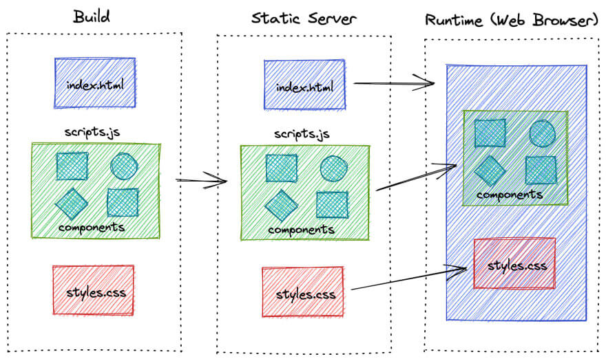
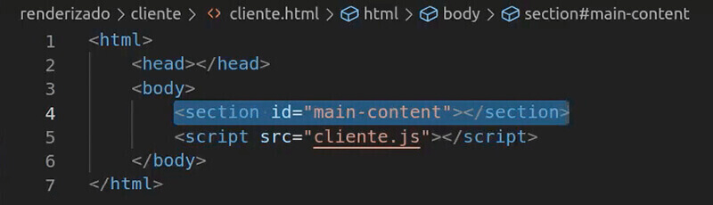
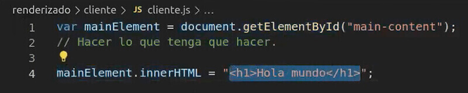

El `Client Side Rendering (CSR)` es un enfoque de renderizado en el que la mayor parte del procesamiento y la construcción de la interfaz ocurre en el navegador del usuario, es decir, descarga y ejecuta los recursos en el **lado del cliente**.

El proceso funciona de la siguiente manera:
1. **Carga:** El cliente hace una petición al servidor, que nos devuelve un archivo `HTML` inicial, con enlaces a archivos `JS`, incluido el _"Framework"_ que estamos usando, y otros recursos necesarios para construir la página.
2. **Construcción:** El navegador tiene la responsabilidad de crear y actualizar el resto del contenido mediante `JS` haciendo la página web visible, interactiva y funcional. Esto quiere decir, que ese `HTML` inicial, tan solo tiene una etiqueta vacía en la que se inyectará todo el contenido dinámicamente con `JS`. Por tanto, el `DOM` se construye y actualiza en el lado del cliente a través del _"Framework"_.

Por esta razón, se conocen también como _`"Single-Page Application (SPA)"`_, ya que el proyecto completo se carga en una única página donde ocurre la mayor parte de la navegación e interacción. Cada vez que el usuario interactúa con la aplicación, solo las partes afectadas se actualizan sin requerir una recarga completa.

Este enfoque tiene ventajas:
1. **Velocidad de interacción:** Tras la carga inicial, las interacciones son ágiles. Esto se debe a que gran parte del contenido, si es común, no requiere reconstrucción y permanece al navegar entre páginas, ya que solo se actualizan las partes que han experimentado cambios.
2. **Experiencia fluida:** La navegación responde de manera inmediata a las acciones del usuario, ya que las actualizaciones ocurren en tiempo real y sin interrupciones.

Sin embargo, también puede tener desventajas:
1. **Rendimiento:** La carga inicial puede ser más lenta, debido a que el usuario debe esperar a que el `JS` se descargue y construya la interfaz, antes de que el contenido sea visible y pueda interactuar con él.
2. **SEO:** Los _"Crawler"_ de los motores de búsqueda pueden tener dificultades para indexar el contenido generado por `JS`. Es decir, no pueden extraer párrafos, enlaces, títulos y demás etiquetas, ya que en la carga inicial no existen en el `HTML`, y por lo general carecen de metadatos, es decir, de URL únicas amigables. El navegador "Chrome" es capaz de indexar el contenido de las aplicaciones `JS` síncronas sin problemas, pero si la aplicación comienza con un proceso de carga de datos a través de una petición `Ajax`, el _crawler_ no esperará a que termine. Esto significa que si tiene contenido obtenido de manera asíncrona, aunque puede realizar _"Scraping"_ (extracción de información) en **SPA**, el uso de **SSR** sigue siendo más valioso para garantizar un mejor SEO.
3. **Seguridad:** Son más vulnerables a ataques de _"Cross-Site Scripting (XSS)"_, es decir, usuarios maliciosos pueden inyectar scripts en tu web, ya que toda la lógica está en el _"Frontend"_.
4. **Accesibilidad:** Aunque no es común, si el usuario tiene el `JS` deshabilitado en su navegador, es posible que la aplicación no funcione correctamente o incluso no funcione en absoluto, lo que puede afectar negativamente la experiencia del usuario.

Es especialmente útil para crear interfaces que involucran funcionalidades `CRUD` (Crear, Leer, Actualizar y Borrar), tales como paneles de control, sistemas de inicio de sesión, autenticación o registro, con un dashboard que incluyen formularios o listas de datos. Por ejemplo, sistemas de gestión de contenido para administrar sitios web (CMS), redes sociales, aplicaciones de streaming, plataformas AI (ChatGPT), interfaces 3D o sistemas de gestión de tareas internas. Donde se prioriza la velocidad de interacción y experiencia de usuario en tiempo real sobre el posicionamiento en motores de búsqueda (SEO). Pudiendo aligerar la carga del servidor y evitando la necesidad de renderizar múltiples páginas de manera repetitiva.

Destacan de entre los más populares los _"Frameworks"_ y _"Libraries"_: `Vue` (Alibaba, WhatsApp Web, Glovo, GitLab, Adobe Portfolio), `React` (Facebook, Instagram, Netflix, Spotify), `Angular` (Gmail, Google Analytics, Github, HBO), `Svelte` (Chess, Spotify), `Ember` (LinkedIn), `Polymer` (YouTube Studio, Google Earth), `Backbone` (Trello).

#### Static Site Generation (SSG)

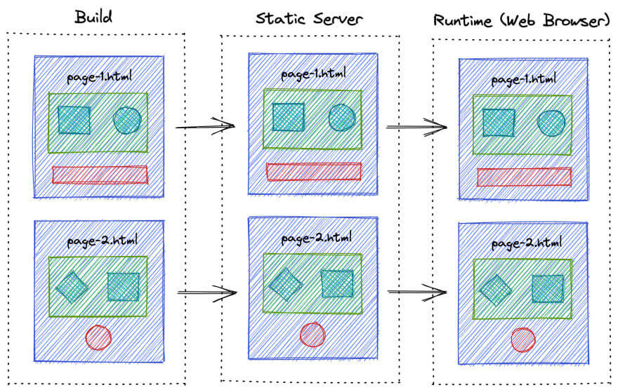

En el método _`"Static Site Generation (SSG)"`_, el proceso de renderizado ocurre en el lado del servidor, durante la fase de construcción de los archivos, antes de que se envíen al cliente. Esto implica pre-renderizar los archivos estáticos, en lugar de generar contenido de manera dinámica en el servidor en respuesta a cada solicitud de usuario.

Estos proyectos, también se conocen como **[JAMStack](https://www.freecodecamp.org/espanol/news/que-es-jamstack/)**, que es el acrónimo de _"JavaScript, APIs and Markup"_. Consiste en crear sitios web utilizando solamente tecnologías _"Frontend"_, como `HTML` para la estructura del sitio, `CSS` para el estilo del sitio, `JS` para la interactividad y la obtención de los datos, y `Markdown` para la generación de páginas estáticas. Toman un conjunto de archivos `Markdown` como entrada y generan un sitio web `HTML` estático a partir de ellos.

Así es como funciona:
1. **Construcción:** Tras el desarrollo, mediante comandos en la terminal, se exporta y compila el código fuente de los componentes, con el contenido, las plantillas y los datos necesarios. Esto genera páginas estáticas pre-renderizadas en forma de archivos `HTML`, `CSS` y `JS`, que están listos para ser alojados en un servicio de almacenamiento u hosting y visualizados a través de un dominio.
2. **Solicitud:** Cuando un usuario accede a una página del sitio web desde el navegador, el servidor proporciona directamente el archivo estático correspondiente.
3. **Interacción:** Cualquier interacción del usuario, como solicitudes de datos o actualizaciones de estado, se manejan mediante los archivos `JS` estáticos en el lado del cliente.

Esto tiene una serie de ventajas:
1. **Rendimiento**: Los usuarios reciben los archivos sin realizar consultas a la base de datos ni renderizaciones en cada petición. Esto produce tiempos de carga más rápidos y, por tanto, una mejor experiencia para el usuario.
2. **Velocidad:** Dado que el contenido rara vez cambia, una vez que un usuario carga una página, las solicitudes posteriores para la misma página se pueden servir directamente desde la caché. Lo que reduce la carga del servidor y mejora los tiempos de carga.
3. **SEO:** Al tener el contenido directamente incrustado en el `HTML` no necesitan ejecutar `JS` para obtener los datos. Esto mejora la indexación, la velocidad de carga, la accesibilidad, el rastreo y clasificación por parte de los motores de búsqueda.
4. **Accesibilidad:** Al tener el contenido previamente, aseguras que esté disponible incluso para usuarios con navegadores o dispositivos que tienen deshabilitada o no admiten la ejecución de `JS`.
5. **Seguridad:** Los sitios estáticos tienen una superficie de ataque más pequeña en comparación con los sitios dinámicos, ya que no hay procesamiento en el lado del servidor ni interacción con la base de datos. Esto puede reducir el riesgo de diversas vulnerabilidades de seguridad comunes en los sitios web dinámicos.

Y una principal desventaja:
1. **Actualizaciones**: Si bien los sitios estáticos son excelentes para mostrar información, tienen limitaciones en términos de interactividad en tiempo real para actualizar el contenido de forma dinámica. Modificar los datos de nuestra página web, requerirá de una nueva compilación de todo el proyecto, aun si es mínimo el cambio, el tiempo que tarde dependerá de lo grande que sea. Podemos automatizar este proceso con herramientas de Integración Continua/Despliegue Continuo (CI/CD), como `GitHub Actions` para hacer la compilación desde un servidor en lugar de nosotros hacerlo en nuestra máquina local.

Por ello, este método es adecuado para sitios web con contenido que no cambia con frecuencia, donde los datos se actualizan periódicamente y no constantemente, como blogs, portafolios, páginas informativas o sitios de documentación.

Muchos de estos, están basados en _"Frameworks"_ ya existentes, es por esto que también son referidos como _`"Meta-Frameworks"`_.  
Destacando entre ellos: `Nuxt` (Vue), `VuePress` (Vue), `VueStorefront` (Vue), `Gridsome` (Vue), `NextJS` (React), `CreateReactApp` (React), `Gastby` (React), `Slate` (React), `Docosaurus` (React), `Hugo` (Go), `Jekyll` (Ruby), `Eleventy/11ty` (JS), `Astro` (JS), `Harp` (JS), `Hexo` (JS), `RMarkdown` (R), `Publii` (App), `Pelican` (Python) y `MkDocs` (Python).

#### Incremental Static Regeneration (ISR)

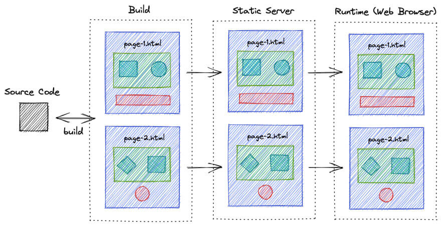

El _`"Incremental Static Regeneration (ISR)"`_ se trata de un enfoque híbrido que utiliza la metodología _"Pre-rendering"_, combinando las ventajas de la generación estática tradicional del **SSG**, con la capacidad de actualizar partes específicas de una página de manera dinámica, en tiempo real del **SSR**.  

Es una técnica introducida por `NextJS`, básicamente, una versión avanzada de **SSG**, que podemos usar para abordar problemas de datos obsoletos. Es decir, sabemos que los sitios web, que usan el método **SSG**, construyen manualmente todos los archivos en el momento de la compilación, excluyendo la caché. Estas páginas son pre-construidas desde el ordenador del desarrollador, mediante un comando como `npm run build`, y los archivos son subidos por `FTP`. De manera que ya existen en el servidor antes de que el usuario las solicite y están listas para enviarse al navegador. Pero _¿qué pasa si los datos del CMS han cambiado y el desarrollador no ha vuelto a generar las páginas?_. En resumen, queremos que nuestra página web muestre contenido actualizado cuando los datos cambian en el _"Backend"_.

Funciona de la siguiente manera:
1. **Construcción:** Se hace la construcción de nuestro proyecto, generando un `HTML` estático a partir de plantillas y archivos con el contenido, y se almacena en la caché del servidor.
2. **Interacción:** Cuándo un usuario visita la página, se inicia un contador y se muestra la versión que fue almacenada en caché, mientras se hace una nueva construcción con los nuevos datos en segundo plano.
3. **Actualización:** Cuando el contador llega a nuestro tiempo especificado, se envía una solicitud al servidor para reconstruir la página solicitada, no toda la aplicación. Por lo que la versión almacenada en caché se actualizará en cada construcción regularmente (por ejemplo, cada hora, cada día, etc.).

Esto permite tiempos de carga más rápidos y, al mismo tiempo, que el sitio web se actualice regularmente con contenidos frescos. Por lo tanto, el factor de rendimiento no se ve afectado, lo que proporciona buen posicionamiento (SEO) y velocidad, gracias a la disponibilidad instantánea de las páginas.

Un ejemplo de aplicación que utiliza **ISR** es un sitio web de noticias que actualiza su contenido varias veces al día.

Destacan los _"Meta-Frameworks"_: `NextJS` (React) y `Analog` (Angular).

#### Distributed Persistent Rendering (DPR)

El _`"Distributed Persistent Rendering (DPR)"`_, permite a los desarrolladores definir qué rutas tendrán mayor importancia durante el renderizado para generar dichos archivos, teniendo en cuenta el tiempo que ha pasado desde que un usuario visitó dicha ruta.  
Con esta técnica las rutas más visitadas de nuestro sitio web serán construidas constantemente dependiendo de la actualización de contenido que hagamos y las menos visitadas tendrán menos importancia, por lo que las rutas menos visitadas serán más lentas de cargar, debido a que no tienen esa relevancia, ya que se crean bajo demanda.

Gracias a esto, los recursos del servidor están más seguros. Pero su mayor ventaja, es que al minimizar el período de actualización, los usuarios nunca verán contenido antiguo.

#### Edge Rendering

El _`"Edge Rendering"`_ consiste en una técnica de red similar a las CDN, que son servidores distribuidos alrededor del mundo. Así, cuándo un usuario visita nuestro sitio web, este se enviará desde un servidor cercano geográficamente al propio usuario, experimentando una velocidad de carga más rápida, ya que los datos no tendrán que viajar desde servidores lejanos.

Si bien esta no es una técnica que podamos implementar con algún _"Framework"_, la proporcionan servicios como `Vercel Edge Functions`, `Netlify Edge`, `Cloudflare Workersy` entre algunos otros.

#### Isomorfic/Universal Applications

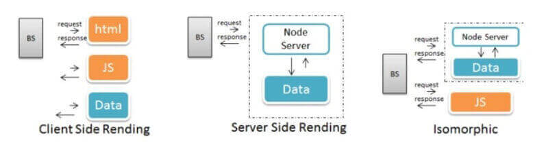

El _"Framework"_ `Vue` se desarrolló principalmente para aplicaciones en lado del cliente, donde los componentes generan y manipulan el `DOM` en el navegador.  
Sin embargo, también puede considerarse `isomórfica o universal`, cuando sus componentes pueden ser renderizados tanto en el **lado del servidor** como en el **lado del cliente**. Esto implica que el `JS`, puede manipular los datos de la aplicación, ejecutándose en ambos lados.

El proceso funciona de la siguiente manera:
1. **Representación:** Se genera la carga inicial de la página, convirtiendo los componentes en cadenas de `HTML` estático, renderizadas en el servidor y enviadas al navegador.
2. **Interacción:** El cliente analiza el `HTML` recibido en busca de recursos, para solicitarlos al servidor. Lo que significa, que mientras el usuario interactúa con la vista inicial, se realizará la carga en segundo plano.
3. **Hidratación:** El cliente recibe los datos en formato `JSON` y la lógica en `JS`, para _"rehidratar"_ la aplicación sin necesidad de renderizarla de nuevo. Lo que significa que la página no se recarga, por lo que no hay interrupciones visibles para el usuario.

Esto tiene varias ventajas significativas que mejoran:
1. **Velocidad:** La carga inicial de la página muestra contenido estático al usuario de inmediato.
2. **SEO:** Los motores de búsqueda pueden rastrear e indexar el contenido generado en el servidor, optimizando los resultados de búsqueda y alcanzando una mayor audiencia.
3. **Experiencia:** Los usuarios pueden interactuar con la página de forma fluida.

Por ejemplo, el _"Meta-Framework"_ `Nuxt`, está configurado de forma automática para abstraer la complejidad del proceso de `renderizado isomórfico`, lo que hace que sea más fácil para los desarrolladores crear aplicaciones con estas capacidades sin tener que lidiar directamente con los detalles técnicos del proceso.

Aquí hay algunos ejemplos:
1. **Estructura:** Cuando creas una nueva aplicación, la estructura de carpetas y archivos está diseñada para facilitar el renderizado.
2. **Rutas:** Permite definir `rutas estáticas`, que son pre-generadas, y `rutas dinámicas`, que dependen de datos y se renderizan cuando son solicitadas.
3. **Navegación:** Después de la carga inicial, las transiciones entre páginas se manejan a través de `JS`, lo que brinda una experiencia más fluida al usuario.
4. **Datos:** Proporciona métodos como `asyncData` y `fetch`, para cargar datos de manera asincrónica, lo que garantiza que los datos estén disponibles antes de renderizar la página.
5. **Componentes:** Coordinar este proceso para que los componentes se carguen y muestren correctamente en ambos lados.

## Referencias

-   [Educative: What is server-side rendering?](https://www.educative.io/answers/what-is-server-side-rendering)
-   [VUE: Server-Side Rendering (SSR)](https://vuejs.org/guide/scaling-up/ssr.html#ssr-vs-ssg)
-   [Elabismodenull: Introducción a Server-Side Rendering](https://elabismodenull.wordpress.com/2017/07/05/vuejs-introduccion-a-server-side-rendering/)
-   [Vue Community: Server Side Rendering](https://vue-community.org/guide/ecosystem/server-side-rendering.html)
-   [A Step-By-Step Guide to Server-Side Rendering with VueJS](https://www.syncfusion.com/blogs/post/a-step-by-step-guide-to-server-side-rendering-with-vuejs.aspx)
-   [Medium: How to Server Side Rendering (SSR) with Vue.js?](https://medium.com/swlh/how-to-server-side-rendering-ssr-with-vue-js-71cedce7c299)
-   [Cuando se utiliza server-side rendering (SSR) en proyectos Vue.js](https://ktquez-play.web.app/es/posts/cuando-se-utiliza-server-side-rendering-ssr-en-proyectos-vuejs.html)
-   [Renderización del lado del servidor (SSR)](https://runebook.dev/es/docs/vue/guide/scaling-up/ssr)
-   [Comparativa del server-side rendering, client-side rendering y los static site generators](https://www.ionos.mx/digitalguide/paginas-web/desarrollo-web/lenguajes-del-lado-servidor-o-del-cliente-diferencias/)
-   [Youtube: ¿Qué es Server Side Rendering (SSR)?](https://faztweb.com/contenido/que-es-server-side-rendering)
-   [Youtube: Multi Page Application (MPA) vs Single Page Application (SPA)](https://faztweb.com/contenido/frameworks-mpa-spa)
-   [Aplicaciones SPA vs MPA ¿Qué son y cual elegir?](https://youtu.be/2z0FChkphvo)
-   [Youtube: ¿Qué Son los Generadores de Sitios Estáticos? (SSG)](https://faztweb.com/contenido/generadores-de-sitios-estaticos)
-   [Youtube: CONOCE las diferencias entre SSR y CSR | Server Side Rendering vs Client Side Rendering](https://www.youtube.com/watch?v=_oJUUtv8itU)
-   [¿Sabes qué es el renderizado de una web y por qué tiene una importancia capital en SEO?](https://www.webpositer.com/blog/que-es-renderizado-web-seo.html)
-   [LemonCode: Server Side Rendering I - Conceptos](https://lemoncode.net/lemoncode-blog/2018/5/13/server-side-rendering-i-conceptos)
-   [¿Qué significa lado del cliente y lado del servidor? | Lado del cliente vs. Lado del servidor](https://www.cloudflare.com/es-es/learning/serverless/glossary/client-side-vs-server-side/)
-   [Nuxt - Vue en Modo Fácil](https://blog-es.mimacom.com/nuxt-easy-mode-for-vue/)
-   [Server-Side Rendering vs Client-Side Rendering – Which one to choose?](https://www.infidigit.com/blog/server-side-rendering-vs-client-side-rendering/)
-   [A Closer Look at Client-Side & Server-Side Rendering](https://www.growth-rocket.com/blog/a-closer-look-at-client-side-server-side-rendering/)
-   [Isomorphic Rendering vs. Dynamic Rendering for JavaScript](https://prerender.io/blog/isomorphic-rendering/)
-   [An Overview of Server Side and Isomorphic Async Rendering](https://hackernoon.com/an-overview-of-server-side-and-isomorphic-async-rendering-hr743bsa)
-   [Framework](https://www.edix.com/es/instituto/framework/)
-   [Tutorial de NUXT](https://github.com/i62navpm/Tutorial-Nuxt)
-   [Qué es un servidor web: funcionamiento y tipos](https://www.cloudcenterandalucia.es/blog/que-es-un-servidor-web-funcionamiento-y-tipos/)
-   [¿SE PUEDE ENTRAR EN UNA WEB POR LA IP?](https://86400.es/2007/07/31/%C2%BFse-puede-entrar-en-una-web-por-la-ip/)
-   [What happens when you type a URL in the browser?](https://shankar-kb.medium.com/what-happens-when-you-type-a-url-in-the-browser-e5c882b5a5ea)
-   [Conoce todas las Técnicas de Renderizado de Sitios Web](https://felixicaza.com/blog/conoce-todas-las-tecnicas-de-renderizado-de-sitios-web)
-   [Frontend Rendering: SSG vs ISG vs SSR vs CSR — When to use which?](https://tapajyoti-bose.medium.com/frontend-rendering-ssg-vs-isg-vs-ssr-vs-csr-when-to-use-which-1bf9f39ff07c)
-   [Server Side Render vs. Static Site Generation](https://leonidasesteban.com/blog/ssg)
-   [Tipos de Renderizado - CSR & SSR & SSG & ISR - con Next.js](https://www.stewartgf.com/blog/tipos-de-renderizado-en-2021-con-next-js)
-   [Front-End CSR, SSR, SSG — Can You Really Tell the Difference?](https://javascript.plainenglish.io/front-end-csr-ssr-ssg-can-you-really-tell-the-difference-8ddedc9c05d6)
-   [Web Rendering: What Is SSR, CSR, SSG, and ISR?](https://fajarwz.com/blog/web-rendering-what-is-ssr-csr-ssg-and-isr/)
-   [Medium: SSR - SSG - ISR - CSR in Next.js — The Ultimate Guide](https://medium.com/@idrazhar/ssr-ssg-isr-csr-in-next-js-the-ultimate-guide-9d1b90aa995e)
-   [¿Qué es Angular Universal?](http://blog.enriqueoriol.com/2017/12/angular-universal.html)
-   [¿Qué es Scully y por qué (quizás) no lo necesitas?](http://blog.enriqueoriol.com/2020/06/angular-scully.html)
-   [Dev: Visual Explanation and Comparison of CSR, SSR, SSG and ISR](https://dev.to/pahanperera/visual-explanation-and-comparison-of-csr-ssr-ssg-and-isr-34ea)
-   [2022 JavaScript Rising Stars](https://risingstars.js.org/2022/es)
-   [Client-Side Rendering or Server-Side Rendering - What Is the Best Solution for Your Next Application?](https://www.blog.duomly.com/client-side-rendering-vs-server-side-rendering-vs-prerendering/)
-   [Server-Side Rendering Vs Client-Side Rendering: All Webpage Rendering Methods Explained](https://www.coderapper.com/blog/commerce/introduction-to-webpage-rendering-types)
-   [REACT: ¿Es un framework o es una librería?](https://www.linkedin.com/pulse/react-es-un-framework-o-una-librer%C3%ADa-kloustr-labs-s-a-s/?originalSubdomain=es)
-   [¿Es React una biblioteca o un framework?](https://midu.dev/react-biblioteca-o-framework/)
