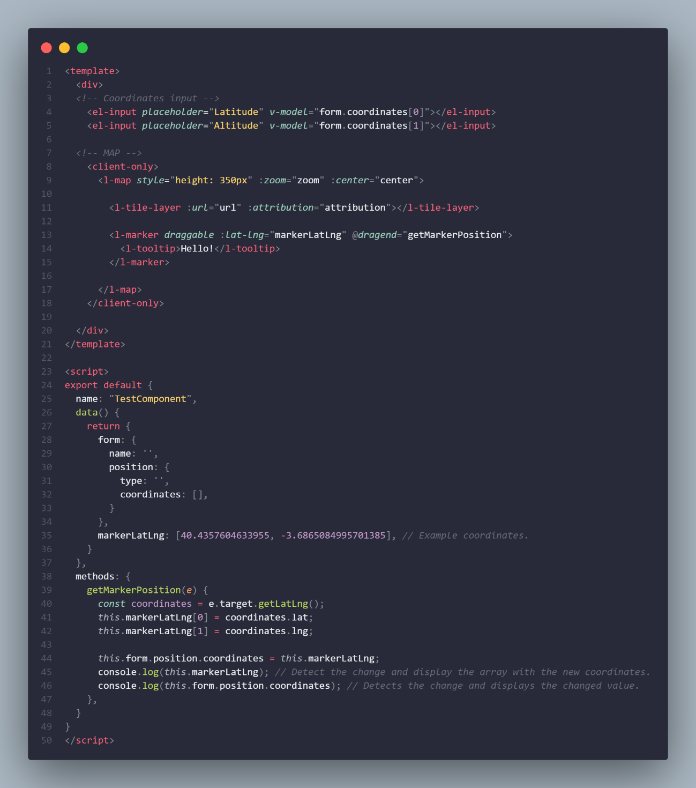

# Walters People / Ejercicio NUXT ISID

## Description

En este documento encontrarás la información de tu prueba técnica para el puesto de **Desarrollador Front-end** en **ISID**.

- [x] Instalación de Nuxt v.2.
- [x] Conexión API con Axios.
- [x] Almacenar datos en Vuex.
- [x] Mostrado de datos.
- [x] Componentes reutilizables.
- [ ] Refactorización de código.

1. Instalación de Nuxt v.2.  
Crear un proyecto con el framework de Vue, **Nuxt**, en su versión 2.

2. Conexión API con Axios.  
Deberás realizar una conexión API con la librería **Axios**. Te damos libertad de utilizar cualquier API con la que te sientas cómod@. No obstante, te dejamos la siguiente URL una API de datos de usuario ficticios: [https://jsonplaceholder.typicode.com/users/](https://jsonplaceholder.typicode.com/users/)

3. Almacenamiento en Vuex.  
Instala la librería **Vuex** y almacena en su store todos los datos de usuario
recibidos en la API.

4. Mostrado de datos.  
Muestra los datos de usuarios desde la store en una tabla generada con la
librería de CSS **Element UI**.

5. Componentes reutilizables.  
Crea un componente reutilizable **Button**.
Deberás crear con el dos instancias. Un "editar" y un "eliminar".
La tabla (punto 4) deberá tener una columna llamada **“Acciones”** en el que
utilizarás estas instancias.

6. Refactorización de código.  
Explica brevemente **cómo refactorizarías** el siguiente código.

